# :mount_fuji: Reto Técnico Zoe.

<br/>
<br/>

## :bookmark_tabs: Tabla de contenido.

<br/>
<br/>

1. [Autor.](#black_nib-autor)

<br/>
<br/>

2. [Detalle de la solución.](#triangular_ruler-detalle-de-la-solución)

<br/>
<br/>

3. [Desplegar.](#airplane-desplegar)

<br/>
<br/>

## :black_nib: Autor.

<br/>
<br/>

**John Fredy Velasco Bareño** [jovel882@gmail.com](mailto:jovel882@gmail.com)

<br/>
<br/>

## :triangular_ruler: Detalle de la solución.

<br/>
<br/>

- Está desarrollado con:

    <br/>
    <br/>

    - PHP 8.1

        <br/>
        <br/>

    - MariaDB 10.3

        <br/>
        <br/>

    - Redis 7.2

        <br/>
        <br/>

    - Laravel 10.28

        <br/>
        <br/>

    - Laravel Horizon

        <br/>
        <br/>

    - Laravel Breeze basado en Inertia con Vue 3 y SSR

        <br/>
        <br/>

    - MailHog

        <br/>
        <br/>

    - Docker y Docker Compose

        <br/>
        <br/>

    Se desarrolló basado en los requerimientos descritos en el documento enviado y se consiguió lo siguiente:

    <br/>
    <br/>

    + Funcionalidades:

        <br/>
        <br/>

        + Modelos, migraciones, Seeder y Factories.

            <br/>
            <br/>

            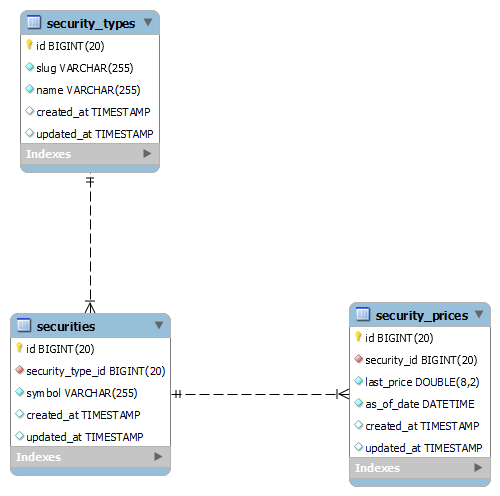

            <br/>
            <br/>

            > Se generaron los 3 modelos base más el de `User` por defecto de la instalación de Laravel.

            <br/>
            <br/>

            + Seeders:

                <br/>
                <br/>

                + `SecurityTypeSeeder`: Genera 20 modelos base para probar, además de un `SecurityType` con su relación de `Security` y `SecurityPrice`.

                <br/>
                <br/>

                + `UserSeeder`: Un usuario de pruebas para acceso al dasboard con el Horizon.

                    <br/>
                    <br/>

                    + `email`: es@es.es

                    <br/>
                    <br/>

                    + `password`: 123456789

                    <br/>
                    <br/>

        + Módulo con el proceso que sincroniza de todos los tipos definidos en BD:

            <br/>
            <br/>

            + Se genero un comando [SyncPricesFromExternal](app/Console/Commands/SyncPricesFromExternal.php) que se ejecuta cada ciertos minutos definidos por la variable de entorno `PROCESS_CONSULT_MINUTES_EXECUTE`. Toma todos los `SecurityType` existentes en BD y los consulta pasándolos al job [SyncSecurityPrice](app/Jobs/SyncSecurityPrice.php).

            <br/>
            <br/>

            + El Job [SyncSecurityPrice](app/Jobs/SyncSecurityPrice.php) cuenta con un solo intento y se genera con un ID único en Redis para evitar duplicidad, hace uso del servicio [SecurityPrice](app/Services/SecurityPrice.php) creado para sincronizar los `SecurityPrice`.

            <br/>
            <br/>

            + Servicio [SecurityPrice](app/Services/SecurityPrice.php) para obtener los `SecurityPrice` desde el servicio externo, para luego actualizarlos o créalos en BD. Si se puede hacer alguna sincronización satisfactoriamente se evite el evento [SynPrice](app/Events/SynPrice.php) que tiene un listener suscrito [SendEmail](app/Listeners/SendEmail.php).

            <br/>
            <br/>

            + Servicio [GetData](app/Services/GetData.php) para obtener los `SecurityPrice` desde el servicio externo.

            <br/>
            <br/>

            + Listener [SendEmail](app/Listeners/SendEmail.php) que usa el servicio [SendEmailSyncPrice](app/Services/Mail/SendEmailSyncPrice.php) para enviar el correo con la sincronización.

            <br/>
            <br/>

            + Servicios para enviar correosa la dirección de correo definida por la variable de entorno `ZOE_EMAIL_NOTIFICATION` cuando se concreta alguna sincronización satisfactoriamente [SendEmailSyncPrice](app/Services/Mail/SendEmailSyncPrice.php) o falla [SendAlertErrorSynPrice](app\Services\Mail\SendAlertErrorSynPrice.php).

                <br/>
                <br/>

                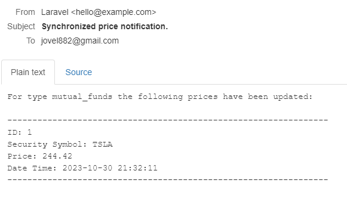

                <br/>
                <br/>

                > Mensaje de confirmación de sincronización correcta.

                <br/>
                <br/>

                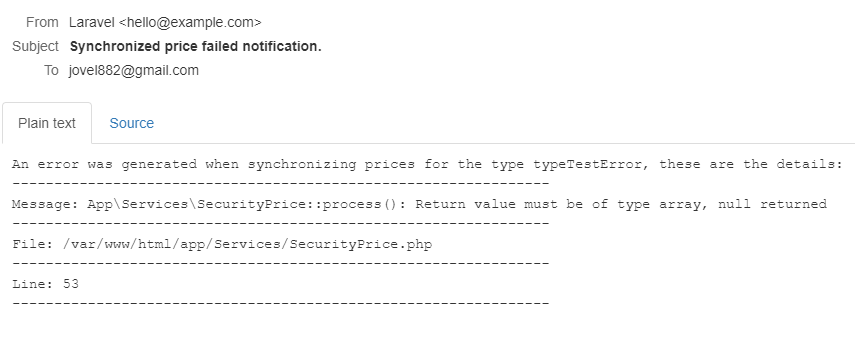

                <br/>
                <br/>

                > Mensaje de error de sincronización.

        <br/>
        <br/>

        + Laravel Breeze basado en Inertia con Vue 3 y SSR para el dasboard con autenticación.

            <br/>
            <br/>

            + Login. Esta bajo la ruta `/login`. Ej. [http://zoe.test/login](http://zoe.test/login)

                <br/>
                <br/>

                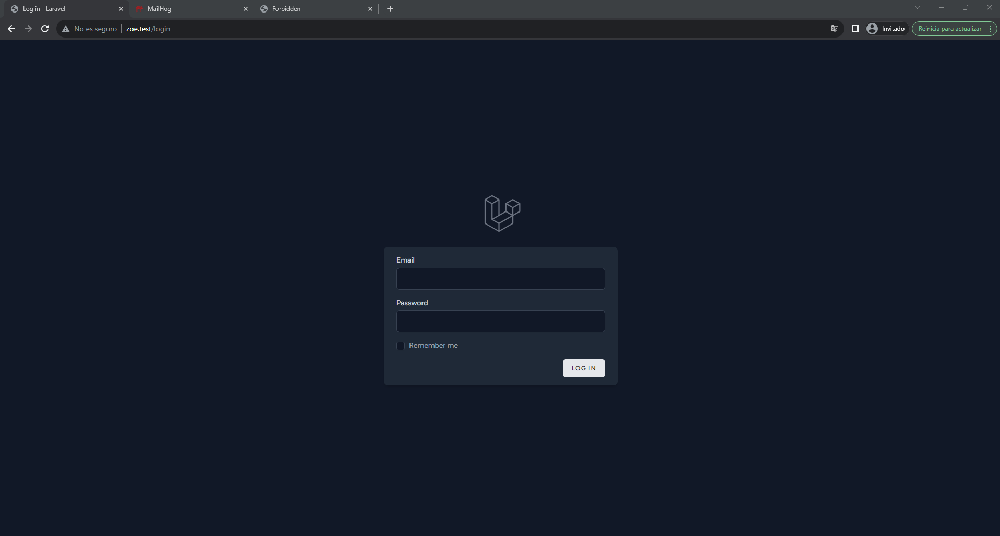

                <br/>
                <br/>

                > Interfaz de login al dashboard. Puede usarse los datos del `UserSeeder`.

            <br/>
            <br/>

            + Dashboard. Esta bajo la ruta `/dashboard`. Ej. [http://zoe.test/dashboard](http://zoe.test/dashboard)

                <br/>
                <br/>

                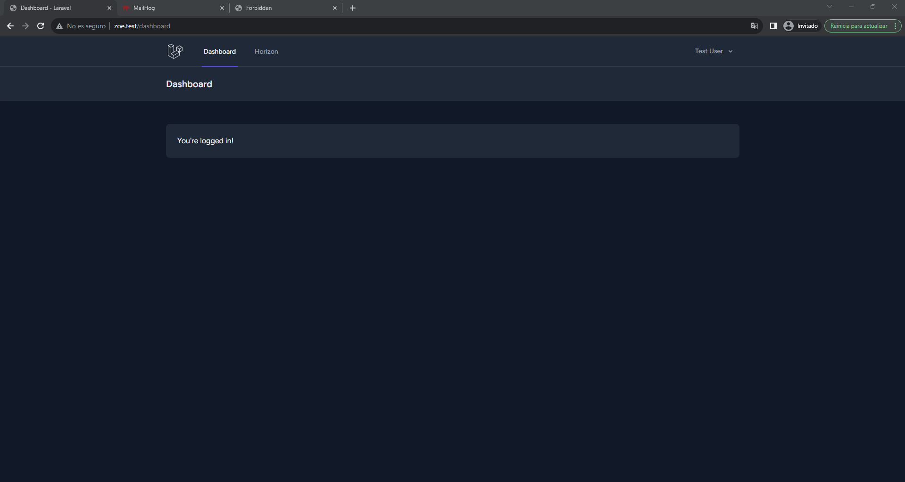

                <br/>
                <br/>

                > Interfaz del dashboard, cuenta con la opción en el menú del `Horizon`.

        <br/>
        <br/>

        + Laravel Horizon. Esta bajo la url `/horizon` Ej. [http://zoe.test/horizon](http://zoe.test/horizon).

            <br/>
            <br/>

            > :bulb: Puedes acceder unicamente estando autenticado.

            <br/>
            <br/>

            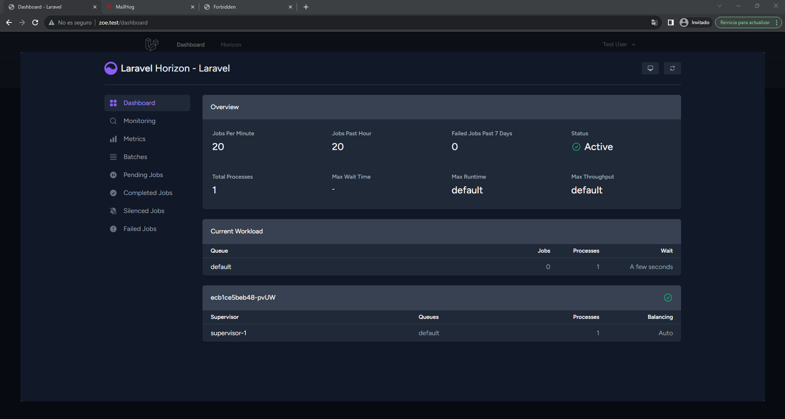

            <br/>
            <br/>

            > Interfaz de horizon embebida dentro del panel usando la opción el menu.
                
            <br/>
            <br/>

            + Completed Jobs.
                
                <br/>
                <br/>

                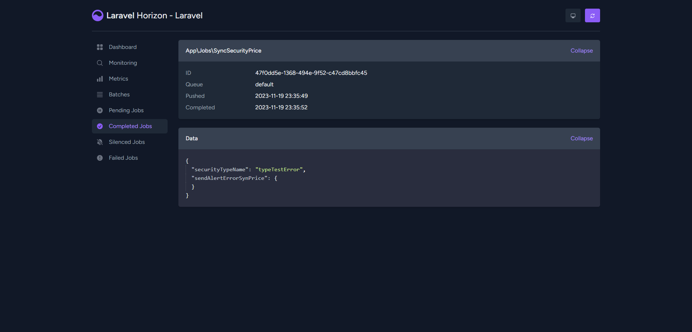

                <br/>
                <br/>

                > Ejemplo de un trabajo procesado correctamente.

            <br/>
            <br/>

            + Failed Jobs.
                
                <br/>
                <br/>

                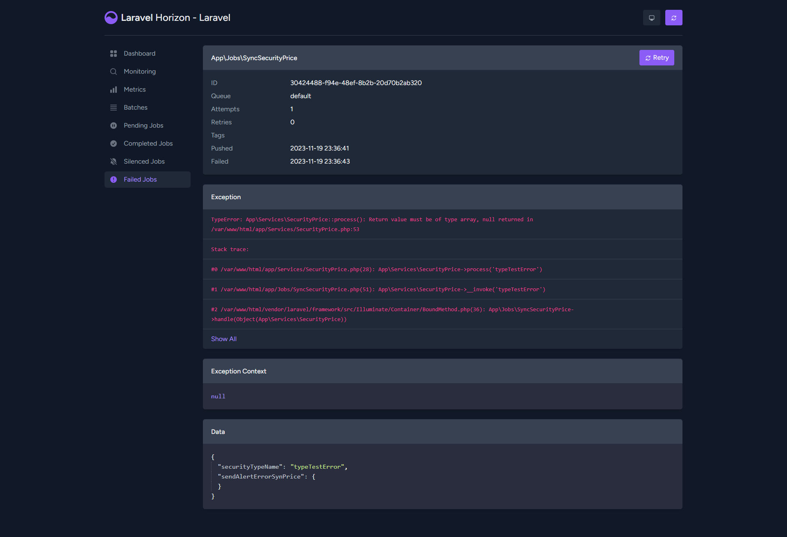

                <br/>
                <br/>

                > Ejemplo de un trabajo fallido luego de hacer todos los intentos.

            <br/>
            <br/>

        + Endpoint para sincronizar un tipo especifico. Se desarrollo bajo en la url `/api/v1/sync_price?type=` y el methodo `POST`. Ej. [http://zoe.test/api/v1/sync_price?type=](http://zoe.test/api/v1/sync_price?type=).

            <br/>
            <br/>

            > :bulb: Se maneja como un endpoint API con response Json y códigos de estado correspondientes.

            <br/>
            <br/>

            + Se hace uso del servicio [SecurityPrice](app/Services/SecurityPrice.php) para procesar el `type` especificado.

                <br/>
                <br/>

                > :bulb: Como se hace uso del servicio se emiten las mismos mensajes dependiendo el resultado de la sincronización.
                
                <br/>
                <br/>

                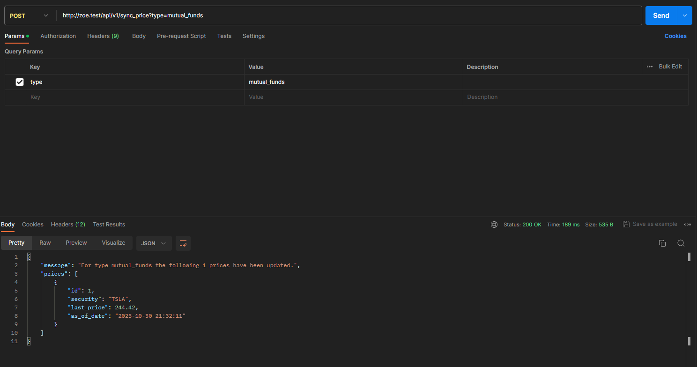

                <br/>
                <br/>

                > Ejemplo de request y response que se procesa correctamente.

            <br/>
            <br/>

            + FormRequest [SyncPriceRequest](app/Http/Requests/SyncPriceRequest.php) para validar que el parámetro `type` este presente.

                <br/>
                <br/>

                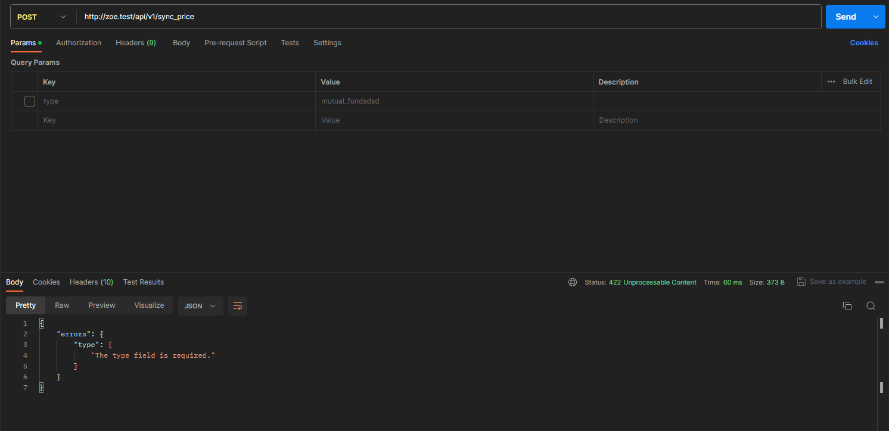

                <br/>
                <br/>

                > Ejemplo de request y response con errores de validación.

            <br/>
            <br/>

            + Errores.

                <br/>
                <br/>

                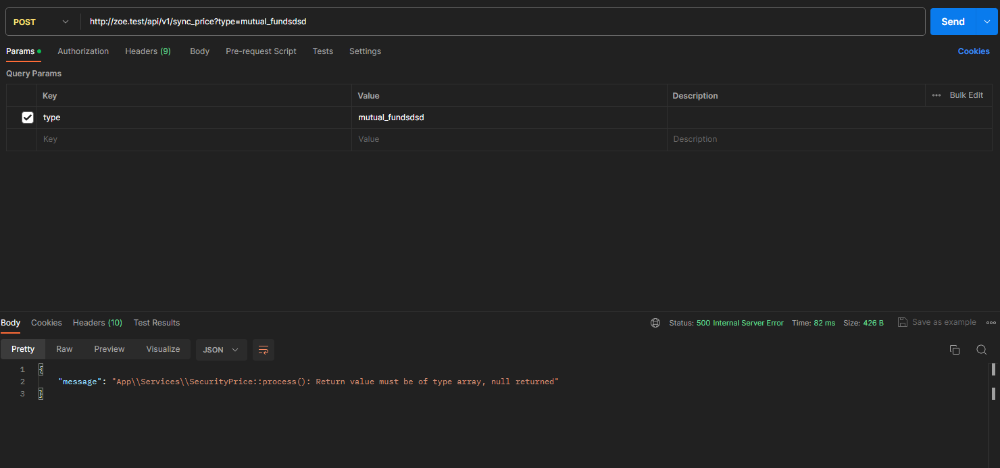

                <br/>
                <br/>

                > Ejemplo de request y response con errores.

        + Unit Test.

            <br/>
            <br/>

            + [SecurityPriceTest](tests/Unit/Services/SecurityPriceTest.php): Se testeo todo el flujo del servicio [SecurityPrice](app/Services/SecurityPrice.php), logrando una cobertura del 100%, que es el Core de las dos funcionalidades tanto el proceso de sincronización de todos los `SecurityType` como del Endpoint para hacerlo sobre uno solo.

                <br/>
                <br/>

                > :loudspeaker: Si se despliega usando la imagen personalizada, se genera el informe de cobertura y puedes ver el estado puntual de del servicio [SecurityPrice](app/Services/SecurityPrice.php) en [http://zoe.test/coverage/Services/SecurityPrice.php.html](http://zoe.test/coverage/Services/SecurityPrice.php.html).

                <br/>
                <br/>

                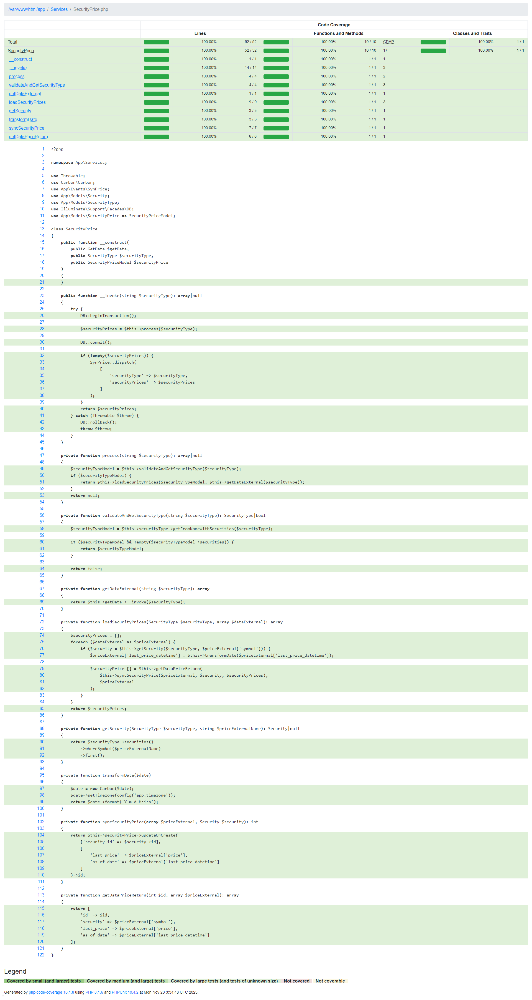

                <br/>
                <br/>

                > Detalle de la cobertura del servicio [SecurityPrice](app/Services/SecurityPrice.php).

            <br/>
            <br/>

## :airplane: Desplegar.

<br/>
<br/>

El proyecto cuenta con una opción de despliegue contenerizada con Docker, para usarla siga los siguientes pasos.

<br/>
<br/>

> :loudspeaker: Se creo una imagen personalizada para el despliegue [Dockerfile](/Dockerfile).

<br/>
<br/>

> :loudspeaker: El ambiente despliega un servidor [MailHog](https://github.com/mailhog/MailHog) para poder probar los correos como servidor SMTP. Ej. [http://mail.zoe.test/](http://mail.zoe.test)

<br/>
<br/>

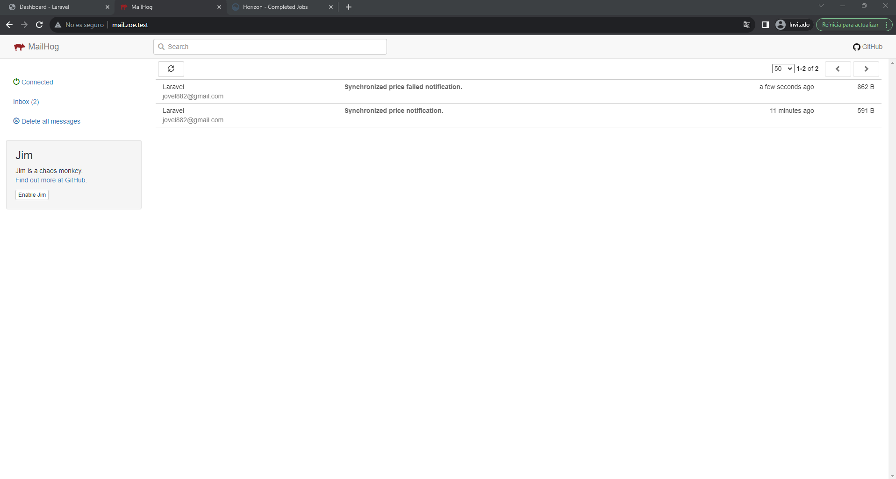

<br/>
<br/>

> Interfaz base de MailHong para visualizar los correos salientes como servidor SMTP.                

<br/>
<br/>

> :loudspeaker: El ambiente genera un informe de cobertura de pruebas accesible desde la url `/coverage`. Ej. [http://zoe.test/coverage](http://zoe.test/coverage)

<br/>
<br/>

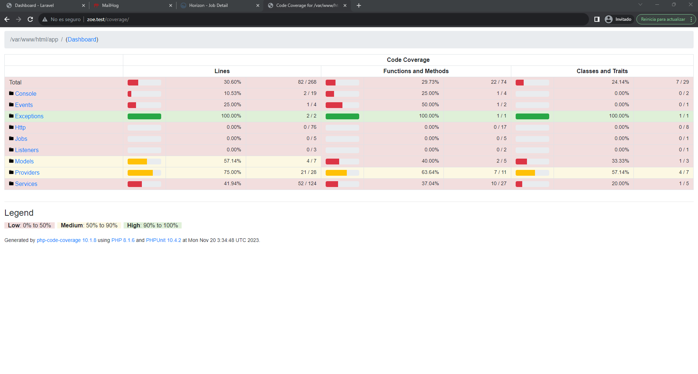

<br/>
<br/>

> Interfaz base del informe de cobertura.                

<br/>
<br/>

+ Prerrequisitos

    <br/>
    <br/>

    + **Docker >= 24.\***

    <br/>
    <br/>

    + **Docker Compose >=2.\***

    <br/>
    <br/>

    + **Git >=2.\***

    <br/>
    <br/>

+ Pasos

    <br/>
    <br/>

    > :bulb: Si está sobre algún sistema basado en Linux y ejecuta la siguiente línea, se iniciará un ambiente totalmente funcional sobre el DNS [zoe.test](http://zoe.test/).

    <br/>
    <br/>

    ```sh
    git clone https://github.com/jovel882/zoe.git && cd zoe && cp Docker/.env.example Docker/.env && docker compose -f Docker/docker-compose.yml up -d && docker logs -f zoe
    ```

    <br/>
    <br/>

    <br/>
    <br/>

    + Clone el repositorio

        <br/>
        <br/>

        ```sh
        git clone https://github.com/jovel882/zoe.git
        ```

        <br/>
        <br/>

    + Ingrese al folder del proyecto.

        <br/>
        <br/>

        ```sh
        cd zoe
        ```

        <br/>
        <br/>
            
    + Cree el archivo de entorno basados en el de ejemplo.

        <br/>
        <br/>

        + Genere el ***.env*** dentro del folder de [Docker](/Docker/), estas son las variables disponibles.

            <br/>
            <br/>

            ```sh
            cp Docker/.env.example Docker/.env
            ```

            <br/>
            <br/>
            
            + `COMPOSE_PROJECT_NAME` (\*Requerido): Define el nombre del proyecto que se genera con Docker Compose, en el ejemplo se deja **zoe**.

            <br/>
            <br/>
            
            + `MYSQL_DATABASE` (\*Requerido): Define el nombre de la base de datos que se creará.

            <br/>
            <br/>
            
            + `MYSQL_ROOT_PASSWORD` (\*Requerido): Define la contraseña del usuario root del motor de base de datos. **NOTA: No dejar vacío**.

            <br/>
            <br/>
            
            + `REDIS_PASSWORD` (\*Requerido): Define la contraseña del usuario root del Redis.

                <br/>
                <br/>
                
                > :loudspeaker: Tenga en cuenta que debe coincidir con el definido dentro del archivo de configuración del Redis [redis.conf](Docker/redis.conf) en la variable `requirepass`.

                <br/>
                <br/>

    + Variables dentro del archivo [docker-compose.yml](Docker\docker-compose.yml).

        <br/>
        <br/>

        + Dentro del servicio de nombre **"redis_zoe"** en la sección de **"environment"**

            <br/>
            <br/>

            + `VIRTUAL_HOST` (\*Requerido): Define el nombre del DNS sobre el que se levantara el servidor de Redis, por defecto esta **redis.zoe.test**.

            <br/>
            <br/>

            + `VIRTUAL_PORT` (\*Requerido): Define el puerto al que se redirigir el tráfico que acceda al DNS, es importante que coincida con el definido en **ports**. Por defecto esta **6379**.
                
        <br/>
        <br/>

        + Dentro del servicio de nombre **"mdb_zoe"** en la sección de **"environment"**

            <br/>
            <br/>

            + `VIRTUAL_HOST` (\*Requerido): Define el nombre del DNS sobre el que se levantara el servidor de MariaDB, por defecto esta **db.zoe.test**.

            <br/>
            <br/>

            + `VIRTUAL_PORT` (\*Requerido): Define el puerto al que se redirigir el tráfico que acceda al DNS, es importante que coincida con el definido en **ports**. Por defecto esta **3306**.            

        + Dentro del servicio de nombre **"mh_zoe"** en la sección de **"environment"**

            <br/>
            <br/>

            + `VIRTUAL_HOST` (\*Requerido): Define el nombre del DNS sobre el que se levantara el servidor de [MailHog](https://github.com/mailhog/MailHog), por defecto esta **mail.zoe.test**.

            <br/>
            <br/>

            + `VIRTUAL_PORT` (\*Requerido): Define el puerto al que se redirigir el tráfico que acceda al DNS, es importante que coincida con el definido en **ports** para el acceso al UI. Por defecto esta **8025**.            
                
        <br/>
        <br/>

        + Dentro del servicio de nombre **"zoe"** en la sección de **"environment"**

            <br/>
            <br/>

            + `VIRTUAL_HOST` (\*Requerido): Define el nombre del DNS sobre el que se levantará el ambiente, por defecto se utiliza **zoe.test**.
                
            <br/>
            <br/>

    + Ejecute el archivo docker-compose.yml para levantar el ambiente.
    
        <br/>
        <br/>

        ```sh
        docker compose -f Docker/docker-compose.yml up -d
        ```

        <br/>
        <br/>

    + Siga el estado del despliegue del contenedor principal con el siguiente comando.

        <br/>
        <br/>

        ```sh
        docker logs -f zoe
        ```

        <br/>
        <br/>

        > :pushpin: En este log, si todo está correcto, podrá ver la construcción de la imagen de Docker, instalación de paquetes con Composer, instalación de paquetes con NPM, compilado de archivos con NPM, ejecución de migraciones, ejecución de seeders, ejecución de pruebas, generación de informe de cobertura y finalmente el inicio de los servicios del servidor web, horizon, entre otros.

        <br/>
        <br/>

    + Agregue el registro del host para redirigir las peticiones al **DNS** que se definió en **VIRTUAL_HOST** del archivo **"docker-compose.yml"**. En este [enlace](https://www.siteground.es/kb/archivo-hosts/) hay una forma de hacerlo dependiendo de su sistema operativo.

        <br/>
        <br/>
        
        **Ejemplo:**    

        <br/>
        <br/>

        ```sh

        127.0.0.1 zoe.test
        127.0.0.1 mail.zoe.test
        127.0.0.1 redis.zoe.test
        127.0.0.1 db.zoe.test

        ```

    <br/>
    <br/>

    + Acceda al resultado de la solución **http://{DNS}**, donde **DNS** debe ser reemplazado por el que se definió en **VIRTUAL_HOST** del archivo **"docker-compose.yml"**. Ej. [http://zoe.test](http://zoe.test)

    <br/>
    <br/>

    + Acceda al servidor MailHog **http://{DNS}/** donde **DNS** se debe cambiar por el que se definió en **VIRTUAL_HOST** del archivo **"docker-compose.yml"**. Ej. [http://mail.zoe.test/](http://mail.zoe.test)

    <br/>
    <br/>


